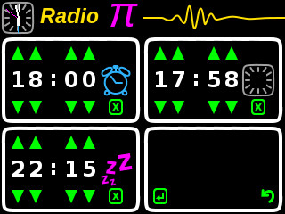

= RadioPi - a raspberry pi internet radio

image:screenshots/radio_pi_07.jpg[Radio Pi,width=60%]
see more at <<screenshots>>

== What is needed?
=== Hardware

* a Raspberry Pi
* a WLAN dongle (for Raspberry < V3)
* a 3.2" touchscreen LCD Display (320x240 px)
* (optional) an acryl case that fits with the display
* (optional) some powerbank

=== Software

* Raspbian OS (a Raspberry Pi Desktop Linux)
* LCD touchscreen display driver (see your documentation where to obtain this)

=== additional content included

* RadioPI uses the services of http://www.radio-browser.info . *Thanks a lot!!*
* the free font package `dejavu-fonts-ttf-2.37`, see https://dejavu-fonts.github.io

== Setup

update raspbian::
[source, bash]
----
sudo apt-get update
sudo apt-get upgrade
----

install the LCD 3.2 display fb-driver::
* install the kernel driver and route the desktop to the display
* you can both use a mouse or the touch display for input
* See your documentation how to setup the driver.

The following instructions f.e. will install a display from `joy-IT`:
[source, bash]
----
# append the following lines to /boot/config.txt
sudo nano /boot/config.txt

dtparam=spi=on
dtoverlay=joy-IT-Display-Driver-32b-overlay:rotate=270,swapxy=1

# append the following parameter to the *first* line of the file
sudo nano /boot/cmdline.txt

fbcon=map:10

# create a file with the following content:
sudo nano /usr/share/X11/xorg.conf.d/99-calibration.conf

Section "InputClass"
    Identifier "calibration"
    MatchProduct "ADS7846 Touchscreen"
    Option "Calibration" "160 3723 3896 181"
    Option "SwapAxes" "0"
EndSection

# change the following line of the file
sudo nano /usr/share/X11/xorg.conf.d/99-fbturbo.conf

Option "fbdev" "/dev/fb1"

# get and install the display driver
wget anleitung.joy-it.net/upload/joy-IT-Display-Driver-32b-overlay.dtb
sudo cp joy-IT-Display-Driver-32b-overlay.dtb /boot/overlays/joy-IT-Display-Driver-32b-overlay.dtbo

# install and copy a file for the touch input
sudo apt-get install xserver-xorg-input-evdev
sudo cp -rf /usr/share/X11/xorg.conf.d/10-evdev.conf /usr/share/X11/xorg.conf.d/45-evdev.conf
----

TIP: if you want to flip the display upside down, change the following parameters::
[source, bash]
----
# change the screen rotation to 90°
sudo nano /boot/config.txt

dtparam=spi=on
dtoverlay=joy-IT-Display-Driver-32b-overlay:rotate=90,swapxy=1

# flip the touch screen calibration values
sudo nano /usr/share/X11/xorg.conf.d/99-calibration.conf

Section "InputClass"
    Identifier "calibration"
    MatchProduct "ADS7846 Touchscreen"
    Option "Calibration" "3723 160 181 3896"
    Option "SwapAxes" "0"
EndSection

# THAT'S ALL :)
----

install additional software::
* `pulseaudio` and `vlc` for playback
* `python3` (may be already installed)
* some `python3` libraries

[source, bash]
----
sudo apt-get install pulseaudio pulseaudio-utils
sudo apt-get install vlc
sudo apt-get install python3 python3-pip python3-pygame
----

install `RadioPi`::
* copy folder `RadioPi` to `/home/pi`
* make shell-scripts executable

[source, bash]
----
pi@raspberrypi:~ $ cd RadioPi
pi@raspberrypi:~/RadioPi $ chmod +x *.sh
pi@raspberrypi:~/RadioPi $ chmod +x network/*.sh
----

test installed libraries::
[source, bash]
----
pi@raspberrypi:~/RadioPi python3 testlib.py
pygame 1.9.4
Hello from the pygame community. https://www.pygame.org/contribute.html
=> all required python libs available
----

make `RadioPi` start at boot::

[source, bash]
----
mkdir ~/.config/autostart
cp radiopi.desktop ~/.config/autostart
----

reboot system::
[source, bash]
----
sudo reboot
----

*Problems? send a note to `christian at dreierschach.de` :-)*

[[screenshots]]
== Screenshots

[cols="1,1"]
|===
a|All views - now with clock::
image:screenshots/radio_pi_09.jpg[Radio Pi]
a|Clock setup view - set actual, wake and sleep time::

a|Settings view - no connection::
image:screenshots/radio_pi_01.jpg[Radio Pi]
a|Settings view - change WLAN::
image:screenshots/radio_pi_02.jpg[Radio Pi]

a|Select view - initially loading list of radio stations::
image:screenshots/radio_pi_00.jpg[Radio Pi]
a|Select view - with list of stations::
image:screenshots/radio_pi_03.jpg[Radio Pi]

a|Select view - only show favourites::
image:screenshots/radio_pi_04.jpg[Radio Pi]
a|Select view - filtered by "SWR" string::
image:screenshots/radio_pi_05.jpg[Radio Pi]

a|Play view - play selected radio station::
image:screenshots/radio_pi_06.jpg[Radio Pi]
a|Screensaver::
image:screenshots/radio_pi_08.jpg[Radio Pi]
