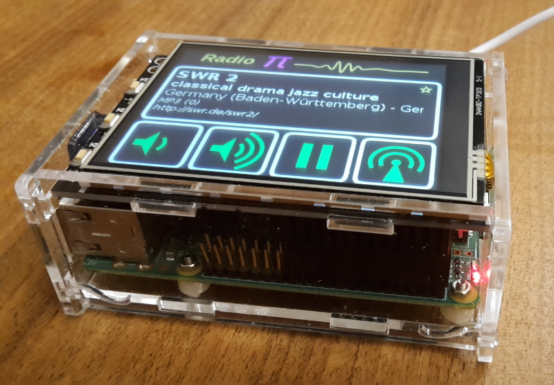
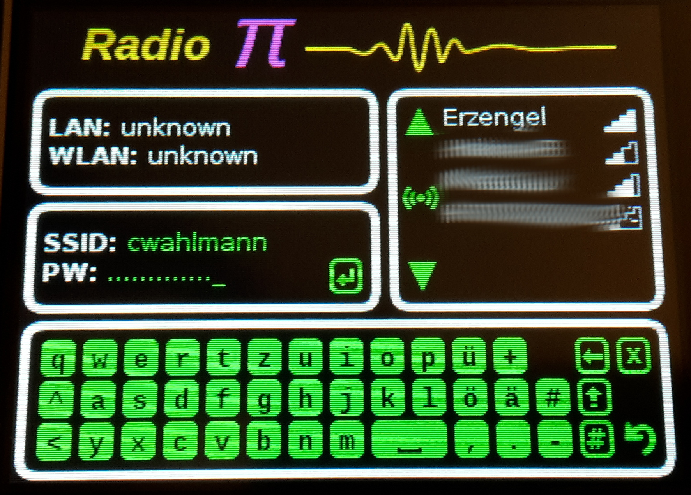
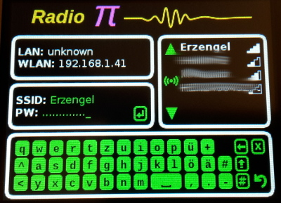
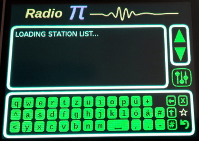
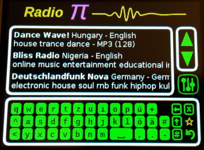
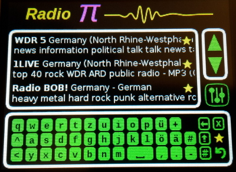
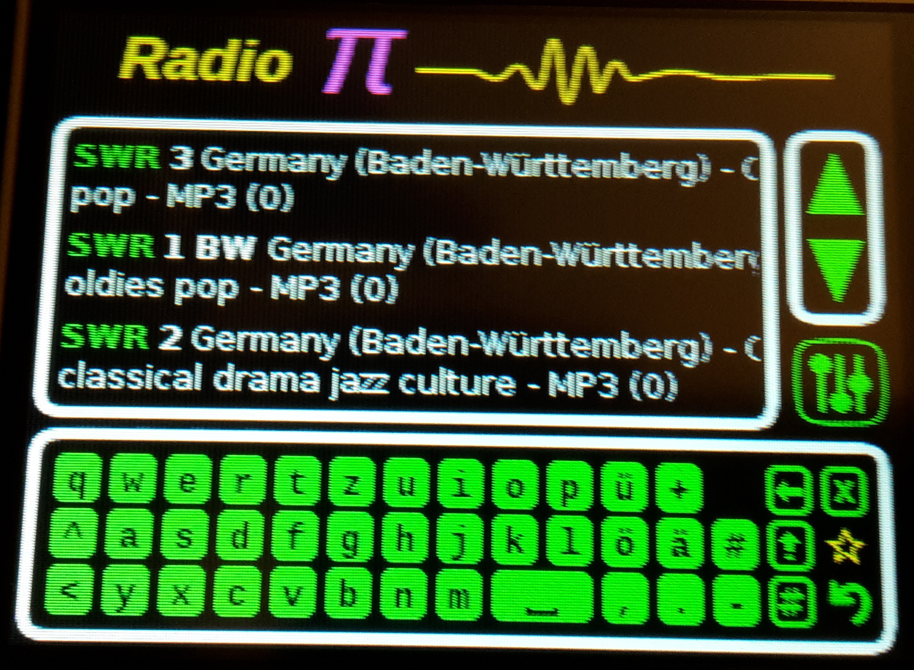
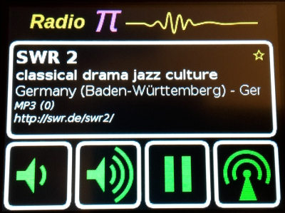

= RadioPi - a raspberry pi internet radio

== What is needed?
=== Hardware
* a Raspberry Pi
* a WLAN dongle (for Raspberry < V3)
* a 3.2" touchscreen LCD Display (320x240 px)
* (optional) an acryl case that fits with the display
* (optional) some powerbank

=== Software
* Raspbian OS lite (a headless linux)

== Setup

. install additional software:
* vlc for playback
* python3 (with pygame, requests, json, threading)

. copy folder `RadioPi` to /home/pi
. edit /etc/rc.local
* append `/home/pi/RadioPi/startup.sh` to the end of the file
. create folder /home/pi/RadioPi/log
. create folder /home/pi/RadioPi/tmp
. reboot system

*Problems? send a note to `christian at dreierschach.de` :-)*

== Screenshots

[cols="1,1"]
|===
a|Settings view - no connection::

a|Settings view - change WLAN::

a|Select view - initially loading list of radio stations::

a|Select view - with list of stations::

a|Select view - only show favourites::

a|Select view - filtered by "SWR" string::

a|Play view - play selected radio station::

|